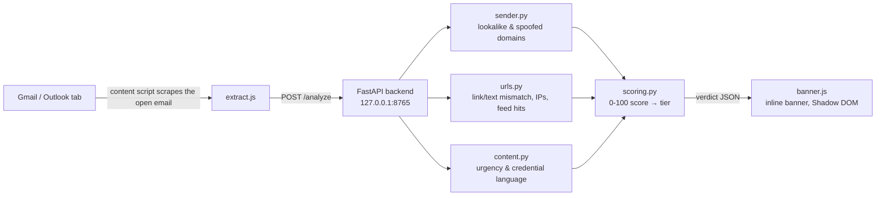

# PhishyEmail

A Chrome extension that reads the email you currently have open in Gmail or Outlook and tells you, in plain language, whether it looks like phishing — all analyzed locally on your own machine.

I'm putting this together while studying cybersecurity, mostly to get past the "I've read about phishing" stage and into "I've actually built something that detects it." Most write-ups on phishing detection stop at a checklist of red flags (mismatched links, urgency language, lookalike domains...). I wanted to see what happens when you turn that checklist into working code, wire it up to a real inbox, and watch it flag a real email.

## What it does

You open an email in Gmail or Outlook web. A content script pulls the sender, subject, body text, links, and attachment names out of the DOM and sends them to a small FastAPI server running on `127.0.0.1`. The server runs the email through a set of heuristic checks, scores it 0–100, and sends back a verdict. A colored banner appears above the message: green ("Looks OK"), yellow ("Suspicious"), or red ("Likely phishing"), with the specific reasons listed underneath.

No email content ever leaves your computer — the only outbound network call the backend makes is a once-a-day sync of the [URLhaus](https://urlhaus.abuse.ch/) malicious-URL feed, and even that's optional; the heuristics work fine offline.



## What it actually catches

Digging into how real phishing emails are constructed turned into most of the learning here. A few of the checks the engine runs:

- **Lookalike sender domains** — `paypa1.com` vs `paypal.com`, scored with Levenshtein distance against a list of protected brands
- **Punycode domains** — `xn--` domains used to fake brand names with homoglyphs
- **Display-name spoofing** — "PayPal Support" sending from a free Gmail/Outlook address, or from a domain that has nothing to do with the claimed brand
- **Link text/href mismatches** — an anchor that visibly reads `www.paypal.com` but actually points somewhere else entirely
- **Raw IP URLs, shorteners, and abused TLDs** — `.zip`, `.top`, `.xyz`-style links, `bit.ly`-style redirects, and links straight to an IP address
- **Credentials-in-URL tricks** — `user@real-looking-host` where `user` is actually the fake destination
- **Urgency and credential-harvesting language** — "verify your account within 24 hours", requests for passwords, OTPs, SSNs, gift cards
- **Risky attachments** — `.exe`, `.js`, `.iso`, `.html` disguised as invoices or receipts
- **A local threat-intel feed** — URLhaus, synced daily into SQLite so lookups stay instant and offline-capable

Every one of these is a `Finding` with a severity and a point value; `scoring.py` sums them into a 0–100 score and buckets it into `ok` / `suspicious` / `phishing`.

## Tech stack

- **Extension:** Manifest V3, vanilla JS content scripts (no build step), Shadow DOM for the banner so Gmail/Outlook's own CSS can't clash with it
- **Backend:** Python, FastAPI + Pydantic for the API contract, SQLite for the local threat-feed cache
- **Fuzzy matching:** `tldextract` for registrable-domain parsing, `rapidfuzz` for lookalike-domain distance
- **Threat feed:** [URLhaus](https://urlhaus.abuse.ch/) CSV feed over `httpx`, refreshed every 24 hours

## Project structure

```
backend/
  main.py              FastAPI app — /analyze, /health, origin lockdown
  models.py            EmailIn / Finding / Verdict — the JS <-> Python contract
  scoring.py           Findings -> 0-100 score -> ok / suspicious / phishing
  feeds.py             SQLite threat-feed store + daily URLhaus sync
  analyzers/
    sender.py          Lookalike domains, punycode, display-name spoofing
    urls.py            Link/text mismatch, IP URLs, shorteners, bad TLDs
    content.py         Urgency language, credential requests, attachments
  test_engine.py       pytest cases used to tune the heuristics

extension/
  manifest.json
  background/service-worker.js   Talks to the backend (must run here, not
                                  in a content script, so the Origin header
                                  the backend checks is chrome-extension://)
  content-scripts/gmail.js       Gmail detection + DOM extraction
  content-scripts/outlook.js     Outlook detection + DOM extraction
  shared/extract.js              unwrapRedirect(), fingerprint(), debounce()
  shared/banner.js                renderBanner() / removeBanner()
```

## Getting started

**1. Start the backend**

```bash
cd backend
pip install -r requirements.txt
uvicorn main:app --host 127.0.0.1 --port 8765
```

**2. Load the extension**

Open `chrome://extensions`, enable **Developer mode**, click **Load unpacked**, and select the `extension/` folder.

**3. Lock it down (recommended before real use)**

By default the backend only accepts requests from a specific extension ID. Copy the ID shown for this extension on `chrome://extensions`, and paste it into `ALLOWED_ORIGINS` in `backend/main.py`:

```python
ALLOWED_ORIGINS = [
    "chrome-extension://<your-extension-id>",
]
DEV_MODE = False
```

(Flip `DEV_MODE = True` during development if you want to skip this and allow any origin.)

**4. Try it**

Open Gmail or Outlook web, click into an email, and a banner should appear above it within about a second. You can also hit the backend directly without the extension at all:

```bash
curl -X POST http://127.0.0.1:8765/analyze -H "Content-Type: application/json" -d '{
  "sender_display": "PayPal Support",
  "sender_address": "security@paypa1.com",
  "subject": "Urgent: verify your account",
  "body_text": "Dear Customer, verify your account within 24 hours.",
  "links": [{"href": "http://paypa1.com.login.xyz/verify", "text": "www.paypal.com"}]
}'
```

That example trips five separate checks at once (lookalike domain, brand/free-mail mismatch, urgency language, credential request, and a link-text/href mismatch) and comes back scored as `phishing`.

Run the test suite with `pytest backend/test_engine.py -v`.

## What I learned

The hardest part wasn't the "obvious" phishing signals — it was avoiding false positives on legitimate email. A domain-wide hit against a threat feed sounds great until you realize `google.com` and `github.io` host both real content and attacker-controlled pages, so one poisoned Google Form would flag every Google Docs link in every inbox. The fix (`feeds.py`) only trusts an *exact URL* match on shared-hosting domains, and only trusts a *domain-wide* match everywhere else.

Same lesson showed up in the link-text/href check: naive DOM text extraction glues sentences together without spaces (`...what's new.Read more...`), and it turns out `.new` and `.read` are both real top-level domains now — so a naive regex reads that as a spoofed link to a domain that doesn't exist. The check now only fires when the "domain-looking" text is essentially the *entire* visible anchor text, which is how real link-spoofing phishing actually presents it.

Building the score-and-tier logic also made clear why phishing detection tools bucket into tiers instead of showing a raw number: a single high-severity finding (a punycode sender domain, say) should never quietly average out to "looks fine" just because the rest of the email is unremarkable.

## Limitations & what's next

- The Gmail/Outlook DOM selectors are best-guess and will break whenever either provider changes their markup without notice — that's the first thing to check if extraction silently stops
- Grammar/spelling analysis is stubbed out in `analyzers/content.py` (deliberately low weight — modern phishing is often well-written)
- Only URLhaus is wired up; there's a `url_cache` table already in `feeds.py` ready for a Safe Browsing–style API, and a noted spot for a PhishTank sync if you have a free API key
- Brand/free-mail-provider lists are Python constants right now — moving them to a JSON config would make them easier to extend without touching code

## Disclaimer

This is a learning project, not a production security product. It's meant to flag suspicious signals for a human to review, not to serve as the sole line of defense against phishing. Don't rely on it as your only protection, and don't point it at inboxes you don't have permission to analyze.
